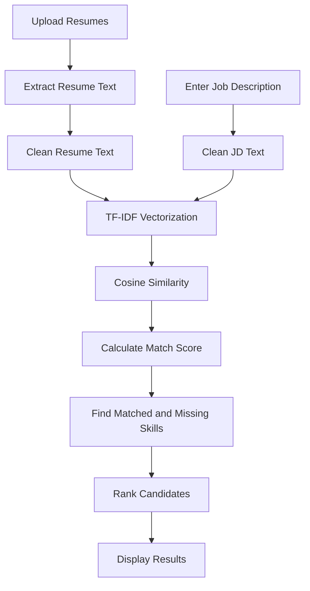

# 🚀 Resume Matcher

### 📄 Smart Resume Screening with Job Description Matching

A clean, fast, and powerful **FastAPI-based Resume Matching App** that compares multiple resumes with a job description and ranks candidates based on their relevance using **TF-IDF Vectorization** and **Cosine Similarity**.

It also highlights the **match score**, **matched skills**, and **missing skills** for every uploaded resume.

<br />


<br />

### 🎯 Upload Resumes → Paste Job Description → Get Ranked Results

</div>

---

## 📌 About the Project

**Resume Matcher** is designed to make resume screening faster and smarter. Instead of manually checking each resume against a job description, this app automatically analyzes resumes and ranks them according to how well they match the required role.

It is useful for:

* 👨‍💼 Recruiters
* 🏢 HR Teams
* 🎓 Students
* 💼 Job Seekers
* 🧑‍💻 Developers building HR-tech tools

The app supports multiple resume formats and provides a simple interface to compare resumes with any job description.

---

## ✨ Key Features

* 📤 Upload **multiple resumes** at once
* 📄 Supports **PDF**, **DOCX**, and **TXT** files
* 📝 Paste any job description directly into the app
* 🎯 Calculates resume-job match percentage
* 🧠 Uses **TF-IDF + Cosine Similarity** for text matching
* ✅ Displays matched skills
* ⚠️ Displays missing skills
* 🏆 Ranks resumes from highest to lowest match score
* ⚡ Fast backend powered by **FastAPI**
* 🐳 Docker-ready setup
* ☁️ Ready for cloud deployment on Render / Hugging Face Spaces
* 🎨 Simple and clean user experience

---

## 🛠️ Tech Stack

| Technology               | Purpose                      |
| ------------------------ | ---------------------------- |
| 🐍 Python                | Core programming language    |
| ⚡ FastAPI                | Backend web framework        |
| 📘 PyPDF2                | PDF text extraction          |
| 📝 python-docx           | DOCX text extraction         |
| 🤖 Scikit-learn          | TF-IDF and cosine similarity |
| 🧮 NumPy                 | Numerical processing         |
| 📊 Pandas                | Data handling                |
| 🐳 Docker                | Containerized deployment     |
| ☁️ Render / Hugging Face | Cloud deployment             |

---

## 📂 Project Structure

```bash
resume-matcher-main/
│
├── app/
│   └── main.py              # Main FastAPI application
│
├── Dockerfile               # Docker configuration
├── render.yaml              # Render deployment config
├── requirements.txt         # Python dependencies
├── runtime.txt              # Python runtime version
├── .gitignore               # Files ignored by Git
└── README.md                # Project documentation
```

---

## 🚀 Getting Started

Follow these steps to run the project locally.

### 1️⃣ Clone the Repository

```bash
git clone https://github.com/your-username/resume-matcher.git
cd resume-matcher-main
```

### 2️⃣ Create a Virtual Environment

```bash
python -m venv venv
```

### 3️⃣ Activate the Virtual Environment

#### Windows

```bash
venv\Scripts\activate
```

#### macOS / Linux

```bash
source venv/bin/activate
```

### 4️⃣ Install Dependencies

```bash
pip install -r requirements.txt
```

### 5️⃣ Run the Application

```bash
uvicorn app.main:app --reload
```

Now open the app in your browser:

```bash
http://127.0.0.1:8000
```

---

## 🧪 How to Use

1. 📤 Upload one or more resumes.
2. 📄 Supported formats: `PDF`, `DOCX`, and `TXT`.
3. 📝 Paste the job description in the text box.
4. 🎯 Click on the matching/check button.
5. 📊 View ranked results with:

   * Match percentage
   * Matched skills
   * Missing skills
   * Processing status

---

## 📊 Example Output

| Rank | Resume File      | Match Score | Matched Skills  | Missing Skills | Status  |
| ---- | ---------------- | ----------: | --------------- | -------------- | ------- |
| 🥇 1 | candidate_1.pdf  |      86.40% | Python, SQL, ML | Docker         | Success |
| 🥈 2 | candidate_2.docx |      72.15% | Python, Excel   | FastAPI, SQL   | Success |
| 🥉 3 | candidate_3.txt  |      58.90% | Communication   | Python, React  | Success |

---

## 🧠 How It Works

The app follows a simple NLP-based workflow:



### Matching Logic

The resume text and job description are converted into numerical vectors using **TF-IDF Vectorization**. Then, **Cosine Similarity** is used to measure how similar each resume is to the job description.

A higher score means the resume is more relevant to the job description.

---

## 🔍 Skills Detection

The app can detect common technical and soft skills such as:

```txt
Python, Java, JavaScript, HTML, CSS, React, Node.js, FastAPI, Flask,
Django, SQL, MySQL, MongoDB, Machine Learning, Deep Learning, NLP,
Pandas, NumPy, Scikit-learn, Excel, Power BI, Tableau, Git, GitHub,
Communication, Leadership, Problem Solving, Data Analysis
```

You can customize the skills list inside:

```bash
app/main.py
```

---

## 🌐 API Endpoints

| Method | Endpoint | Description                                         |
| ------ | -------- | --------------------------------------------------- |
| `GET`  | `/`      | Opens the web interface                             |
| `POST` | `/match` | Uploads resumes and returns ranked matching results |

---

## 🐳 Run with Docker

### Build Docker Image

```bash
docker build -t resume-matcher .
```

### Run Docker Container

```bash
docker run -p 7860:7860 resume-matcher
```

Open in browser:

```bash
http://localhost:7860
```

---

## ☁️ Deployment

### Deploy on Render

Recommended Render settings:

```bash
Build Command: pip install -r requirements.txt
Start Command: uvicorn app.main:app --host 0.0.0.0 --port $PORT
```

### Deploy on Hugging Face Spaces

This README already includes Hugging Face Spaces metadata:

```yaml
---
title: Resume Matcher
sdk: docker
app_port: 7860
---
```

If you are using only GitHub and not Hugging Face Spaces, you can remove these lines from the top.

---

## ✅ Why Use Resume Matcher?

Manual resume screening can be time-consuming and repetitive. Resume Matcher helps automate the first-level screening process by quickly identifying resumes that are closer to the job requirements.

It saves time, improves consistency, and gives a clear overview of candidate-job relevance.

---

## 🔮 Future Improvements

* 📈 Add visual charts for resume comparison
* 🧾 Export results as CSV or PDF
* 🧠 Add semantic matching using transformer models
* 🔐 Add user authentication
* 🎨 Improve frontend design
* 📌 Add role-based skill categories
* 🌍 Add multilingual resume support
* 📊 Add detailed resume score explanation

---

## 🤝 Contributing

Contributions are welcome.

To contribute:

1. 🍴 Fork the repository
2. 🌿 Create a new branch
3. 🛠️ Make your changes
4. ✅ Test the project
5. 🚀 Submit a pull request

---

## 👨‍💻 Author

Made with ❤️ to make resume screening faster, smarter, and easier.

<div align="center">

### ⭐ If you like this project, don't forget to give it a star!

</div>
